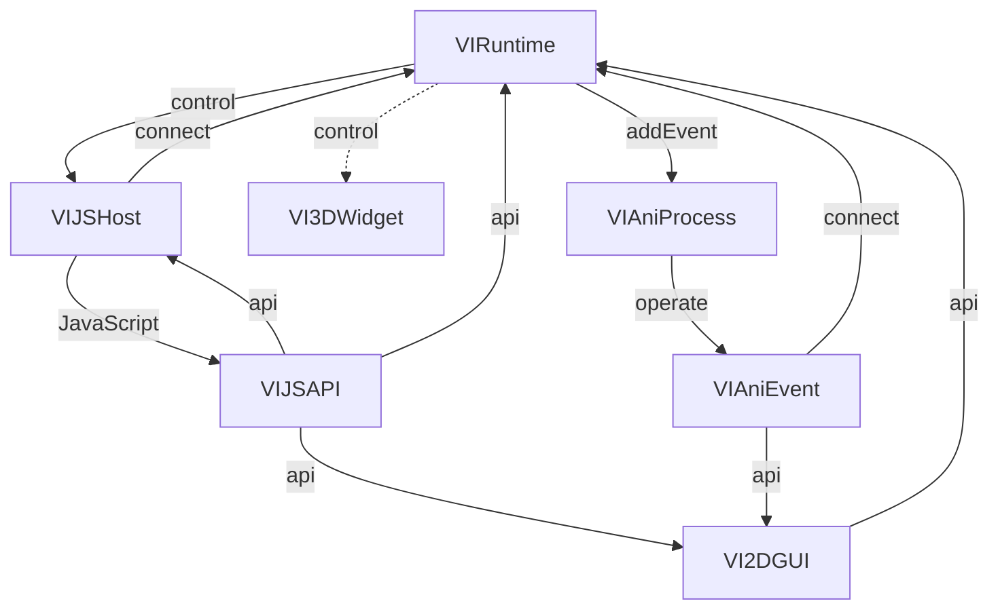
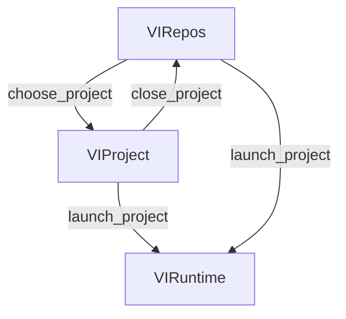

# 现行和计划结构-VisindigoRuntime

```mermaid
graph TB
VIRuntime -- addEvent --> VIAniProcess
VIRuntime -. control .-> VI3DWidget
VIAniProcess -- operate --> VIAniEvent
VIAniEvent -- connect --> VIRuntime
VIRuntime -- control --> VIJSHost
VIJSHost -- connect --> VIRuntime
VIJSAPI -- api --> VIJSHost
VIJSAPI -- api --> VIRuntime
VIJSAPI -- api --> VI2DGUI
VIJSHost -- JavaScript --> VIJSAPI
VIAniEvent -- api --> VI2DGUI
VI2DGUI -- api --> VIRuntime
```

# 计划设计结构-Visindigo窗体逻辑

```mermaid
graph TB
VIRepos -- choose_project --> VIProject
VIProject -- launch_project --> VIRuntime
VIRepos -- launch_project --> VIRuntime
VIProject -- close_project --> VIRepos
```
