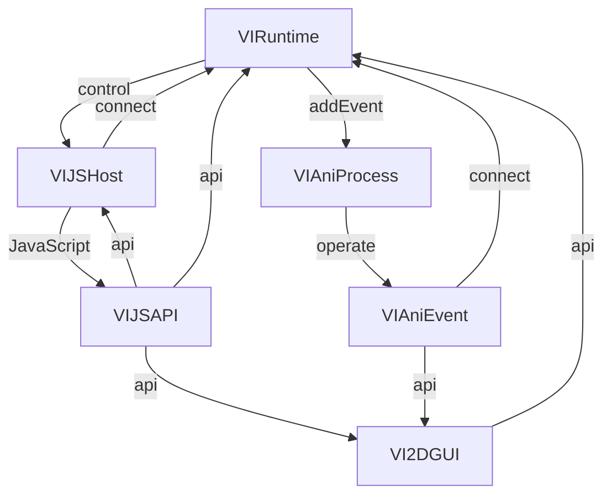

# 现行设计结构

```mermaid
graph TB
VIRuntime -- addEvent --> VIAniProcess
VIAniProcess -- operate --> VIAniEvent
VIAniEvent -- connect --> VIRuntime
VIRuntime -- control --> VIJSHost
VIJSHost -- connect --> VIRuntime
VIJSAPI -- api --> VIJSHost
VIJSAPI -- api --> VIRuntime
VIJSAPI -- api --> VI2DGUI
VIJSHost -- JavaScript --> VIJSAPI
VIAniEvent -- api --> VI2DGUI
VI2DGUI -- api --> VIRuntime
```
