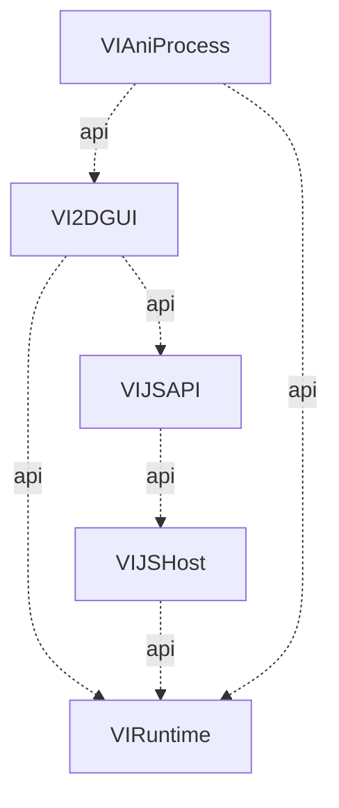
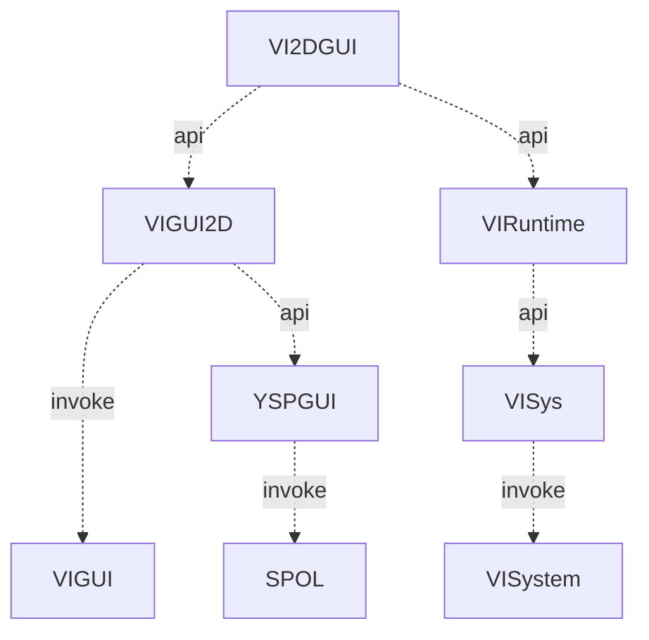
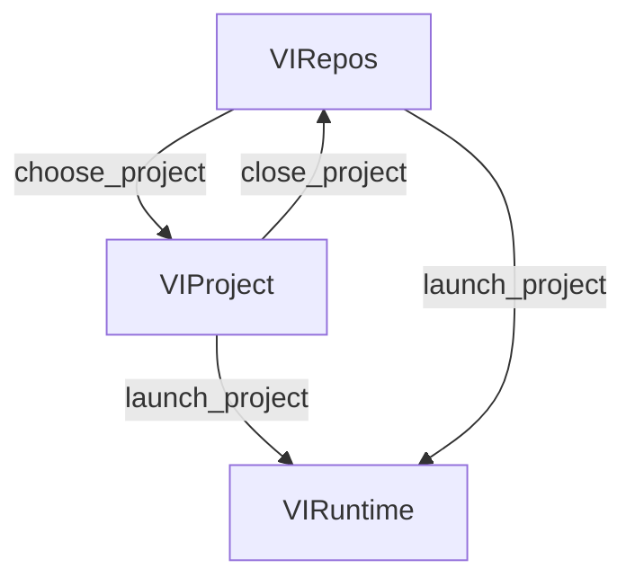

# 现行和计划结构-VisindigoRuntime

```mermaid
graph TB
VIAniProcess -. api .-> VI2DGUI
VI2DGUI -. api .-> VIJSAPI
VIJSAPI -. api .-> VIJSHost
VI2DGUI -. api .-> VIRuntime
VIJSHost -. api .-> VIRuntime
VIAniProcess -. api .-> VIRuntime
```

# 现行和计划结构-VIJSAPI

```mermaid
graph TB
VI2DGUI -. api .-> VIGUI2D
VIGUI2D -. invoke ..-> VIGUI
VIGUI2D -. api .-> YSPGUI
VI2DGUI -. api .-> VIRuntime
YSPGUI -. invoke .-> SPOL
VIRuntime -. api .-> VISys
VISys -. invoke .->VISystem
```

# 计划设计结构-Visindigo窗体逻辑

```mermaid
graph TB
VIRepos -- choose_project --> VIProject
VIProject -- launch_project --> VIRuntime
VIRepos -- launch_project --> VIRuntime
VIProject -- close_project --> VIRepos
```
